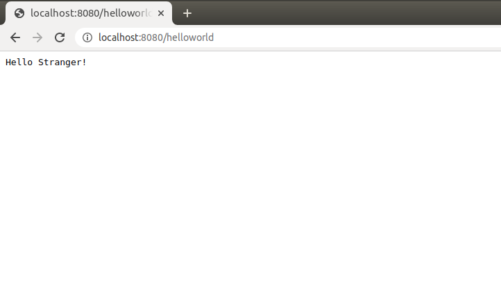
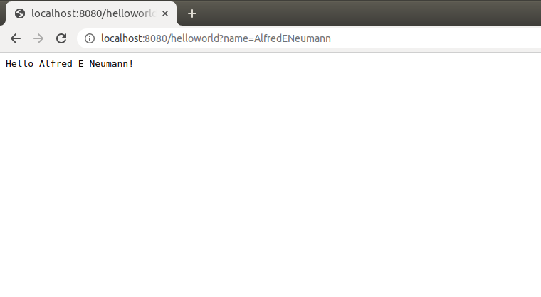
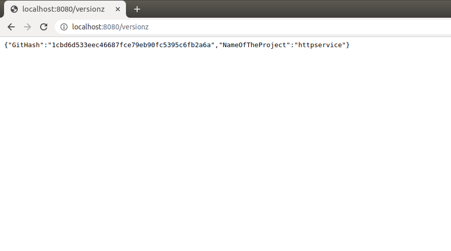

# httpserver in golang with three endpoints
## Type make in the terminal
### --> First endpoint: go to the browser and type 'http://localhost:8080/helloworld' this should return: 

### --> Second endpoint: go to the browser and type 'http://localhost:8080/helloworld?name=WhateverNameYouWant' this should return:

### --> Third endpoint: go to the browser and type 'http://localhost:8080/versionz' this should return: 

